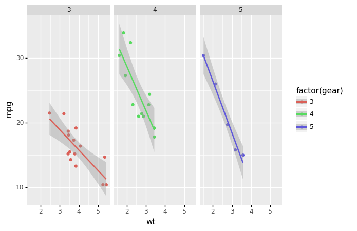

---
javascript:
- https://cdn.jsdelivr.net/npm/vega@5
- https://cdn.jsdelivr.net/npm/vega-lite@5
- https://cdn.jsdelivr.net/npm/vega-embed@6
- https://cdn.plot.ly/plotly-2.8.3.min.js
---


# Images

## Supported formats

Mkreports supports inclusion out of the box of a number of different imaging 
libraries. For each supported library, an example is show below.

For any not supported library, it is still possible to write out the 
image manually and then include it as an `ImageFile` object.

### PIL

=== "Content"

    PIL is the standard python image library. `Image` objects are written
    out to files and included in the markdown.

    Here as an example we simply have a black and white image of a black
    and grey square.
    

=== "Code"

    ```python title="/home/hhoeflin/projects/mkreports/docs/staging/images.py" linenums="31"
    p.Raw(
        """
        PIL is the standard python image library. `Image` objects are written
        out to files and included in the markdown.

        Here as an example we simply have a black and white image of a black
        and grey square.
        """
    )
    img_np = np.zeros((200, 400), dtype=np.uint8)
    img_np[:, 200:400] = 128
    img = Image.fromarray(img_np)
    p.PIL(img)


    ```

---

### Matplotlib

=== "Content"

    For many scientific graphing purposes, `matplotlib` is either the direct
    choice or the backend being used for plotting. 
    

=== "Code"

    ```python title="/home/hhoeflin/projects/mkreports/docs/staging/images.py" linenums="47"
    p.Raw(
        """
        For many scientific graphing purposes, `matplotlib` is either the direct
        choice or the backend being used for plotting. 
        """
    )

    fig, ax = plt.subplots()
    ax.plot([1, 2, 3, 4], [1, 4, 2, 3])
    p.Image(fig)


    ```

---

### Plotnine

=== "Content"

    Any plots created by `plotnine` can be included directly. The code below
    is from the beginner example of the library.
    

=== "Code"

    ```python title="/home/hhoeflin/projects/mkreports/docs/staging/images.py" linenums="59"
    p.Raw(
        """
        Any plots created by `plotnine` can be included directly. The code below
        is from the beginner example of the library.
        """
    )

    p.Image(
        ggplot(mtcars, aes("wt", "mpg", color="factor(gear)"))
        + geom_point()
        + stat_smooth(method="lm")
        + facet_wrap("~gear"),
    )


    ```

---

### Seaborn

=== "Content"

    Another well known option is Seaborn. The interface is similar to the 
    ones before. Under the hood, the `figure` attribute of the seaborn plot is 
    accessed and saved in the same fashion as for matplotlib.
    

=== "Code"

    ```python title="/home/hhoeflin/projects/mkreports/docs/staging/images.py" linenums="74"
    p.add(
        """
        Another well known option is Seaborn. The interface is similar to the 
        ones before. Under the hood, the `figure` attribute of the seaborn plot is 
        accessed and saved in the same fashion as for matplotlib.
        """
    )

    sns.set_theme(style="ticks")

    # Load the example dataset for Anscombe's quartet
    df = sns.load_dataset("anscombe")

    # Show the results of a linear regression within each dataset
    p.Image(
        sns.lmplot(
            x="x",
            y="y",
            col="dataset",
            hue="dataset",
            data=df,
            col_wrap=2,
            ci=None,
            palette="muted",
            height=4,
            scatter_kws={"s": 50, "alpha": 1},
        ),
    )


    ```

---

### Altair

=== "Content"

    <div id='altair_id-0'> </div>

=== "Code"

    ```python title="/home/hhoeflin/projects/mkreports/docs/staging/images.py" linenums="104"
    import altair as alt
    import pandas as pd

    source = pd.DataFrame(
        {
            "a": ["A", "B", "C", "D", "E", "F", "G", "H", "I"],
            "b": [28, 55, 43, 91, 81, 53, 19, 87, 52],
        }
    )

    p.Altair(
        alt.Chart(source).mark_bar().encode(x="a", y="b").properties(width=600)
    )


    ```

---

<script>
    vegaEmbed("#altair_id-0", "../images_store/altair-a7a2eb773c7d9454c694b490a77e5a7e.csv")
    // result.view provides access to the Vega View API
    .then(result => console.log(result))
    .catch(console.warn);
</script>

[comment]: # (id: altair_id-0)

### Plotly

=== "Content"

    <div id='plotly_id-0'> </div>

=== "Code"

    ```python title="/home/hhoeflin/projects/mkreports/docs/staging/images.py" linenums="119"
    import plotly.express as px

    fig = px.scatter(x=[0, 1, 2, 3, 4], y=[0, 1, 4, 9, 16])
    p.Plotly(fig)


    ```

---

<script>
    fetch('../images_store/plotly-2c4e085bcb294e03c4c01a147570a8c5.json')
        .then(function (response) {
            return response.json();
        })
        .then(function (data) {
            doPlotly(data);
        })
        .catch(function (err) {
            console.log('error: ' + err);
        });
    function doPlotly(plotlyJson) {
        Plotly.newPlot("plotly_id-0", {
            "data": plotlyJson["data"],
            "layout": plotlyJson["layout"]
        })
    }
</script>

[comment]: # (id: plotly_id-0)

## Different image sizes

!!! warning 

    Still to be implemented
