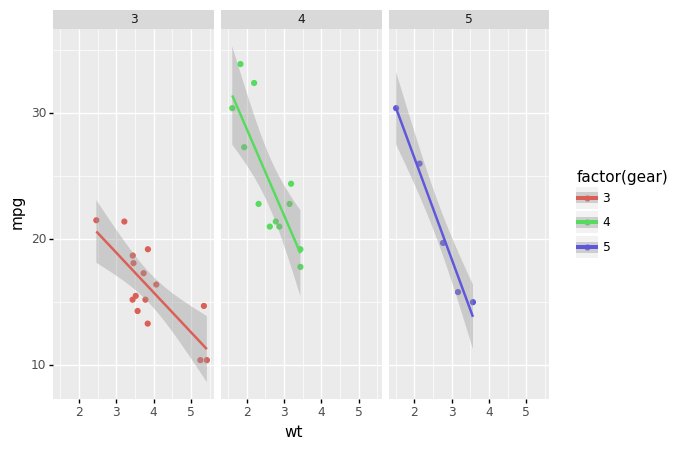

---
css:
- https://unpkg.com/tabulator-tables@5.1.0/dist/css/tabulator.min.css
javascript:
- https://unpkg.com/tabulator-tables@5.1.0/dist/js/tabulator.min.js
- ../assets/assets/min_max_filter.js
---


# Quickstart

First, below the code that was used to create this page. 
It is a very brief example of an page with a table and an image
as well as some text, like here.

```python title="docs/staging/quickstart.py"
--8<-- 'docs/quickstart/quickstart-9203a497d0a71ee9295c90b5ba8bc076.py'
```

We are quickly analyzing the mtcars dataset 
that is included with plotnine.

## Data as a table

=== "Content"

    <div id='tabulator_id-0' class='display'> </div>

=== "Code"

    ```python title=".conda_env/lib/python3.8/site-packages/mkreports/page.py" linenums="157"
        return self

    def __exit__(self, exc_type, exc_val, traceback) -> None:
        self.multi_code_context.__exit__(exc_type, exc_val, traceback)
        if self.multi_code_context.md_obj_after_finish is not None:

    ```

---

<script>
var table = new Tabulator('#tabulator_id-0', {"layout": "fitDataTable", "pagination": true, "paginationSize": 10, "paginationSizeSelector": true, "columns": [{"field": "name", "headerFilter": "input", "title": "Name"}, {"field": "mpg", "width": 80, "headerFilter": minMaxFilterEditor, "headerFilterFunc": minMaxFilterFunction, "headerFilterLiveFilter": false, "title": "Mpg"}, {"field": "cyl", "width": 80, "headerFilter": minMaxFilterEditor, "headerFilterFunc": minMaxFilterFunction, "headerFilterLiveFilter": false, "title": "Cyl"}, {"field": "disp", "width": 80, "headerFilter": minMaxFilterEditor, "headerFilterFunc": minMaxFilterFunction, "headerFilterLiveFilter": false, "title": "Disp"}, {"field": "hp", "width": 80, "headerFilter": minMaxFilterEditor, "headerFilterFunc": minMaxFilterFunction, "headerFilterLiveFilter": false, "title": "Hp"}, {"field": "drat", "width": 80, "headerFilter": minMaxFilterEditor, "headerFilterFunc": minMaxFilterFunction, "headerFilterLiveFilter": false, "title": "Drat"}, {"field": "wt", "width": 80, "headerFilter": minMaxFilterEditor, "headerFilterFunc": minMaxFilterFunction, "headerFilterLiveFilter": false, "title": "Wt"}, {"field": "qsec", "width": 80, "headerFilter": minMaxFilterEditor, "headerFilterFunc": minMaxFilterFunction, "headerFilterLiveFilter": false, "title": "Qsec"}, {"field": "vs", "width": 80, "headerFilter": minMaxFilterEditor, "headerFilterFunc": minMaxFilterFunction, "headerFilterLiveFilter": false, "title": "Vs"}, {"field": "am", "width": 80, "headerFilter": minMaxFilterEditor, "headerFilterFunc": minMaxFilterFunction, "headerFilterLiveFilter": false, "title": "Am"}, {"field": "gear", "width": 80, "headerFilter": minMaxFilterEditor, "headerFilterFunc": minMaxFilterFunction, "headerFilterLiveFilter": false, "title": "Gear"}, {"field": "carb", "width": 80, "headerFilter": minMaxFilterEditor, "headerFilterFunc": minMaxFilterFunction, "headerFilterLiveFilter": false, "title": "Carb"}], "ajaxURL": "../quickstart/tabulator-c8469972d60cd61d98262704e068f4e9.json"});
</script>

[comment]: # (id: tabulator_id-0)

## Some simple plots

=== "Content"

    

=== "Code"

    ```python title=".conda_env/lib/python3.8/site-packages/mkreports/page.py" linenums="157"
        return self

    def __exit__(self, exc_type, exc_val, traceback) -> None:
        self.multi_code_context.__exit__(exc_type, exc_val, traceback)
        if self.multi_code_context.md_obj_after_finish is not None:

    ```

---
