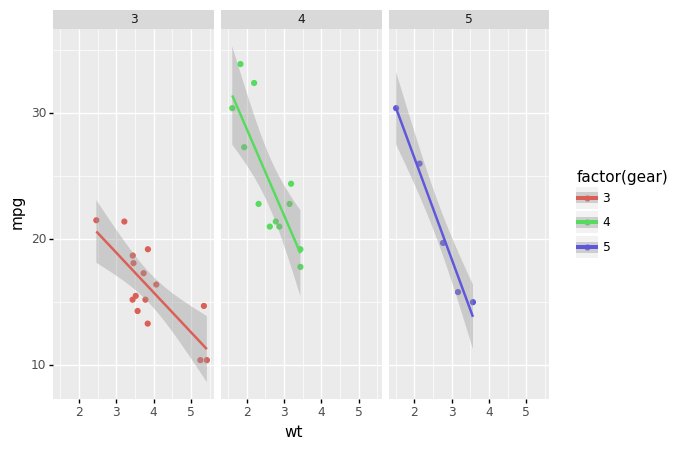
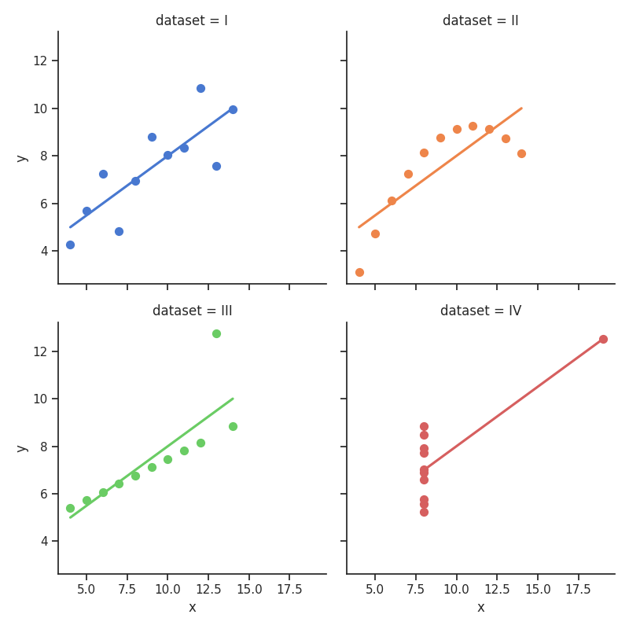
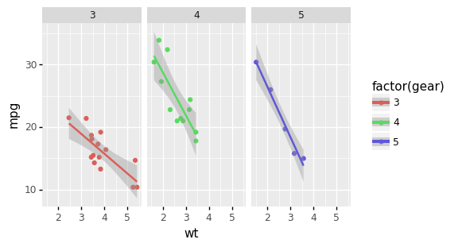
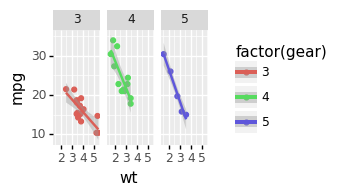

---
css:
- ../../assets/assets/code_admonition.css
javascript:
- https://cdn.jsdelivr.net/npm/vega@5
- https://cdn.jsdelivr.net/npm/vega-lite@5
- https://cdn.jsdelivr.net/npm/vega-embed@6
- https://cdn.plot.ly/plotly-2.8.3.min.js
---


# Images

??? code "Code"

    ```python title="docs/staging/images.py"
    --8<-- 'docs/usage/images/images-904b9e74011d8731fcc104997285400a.py'
    ```

## Supported formats

Mkreports supports inclusion out of the box of a number of different imaging 
libraries. For each supported library, an example is show below.

For any not supported library, it is still possible to write out the 
image manually and then include it as an `ImageFile` object.

### PIL

=== "Content"

    PIL is the standard python image library. `Image` objects are written
    out to files and included in the markdown.

    Here as an example we simply have a black and white image of a black
    and grey square.
    

=== "Code"

    ```python title=".conda_env/lib/python3.8/site-packages/mkreports/page.py" linenums="192"
        return self

    def __exit__(self, exc_type, exc_val, traceback) -> None:
        self.multi_code_context.__exit__(exc_type, exc_val, traceback)
        if self.multi_code_context.md_obj_after_finish is not None:

    ```

---

### Matplotlib

=== "Content"

    For many scientific graphing purposes, `matplotlib` is either the direct
    choice or the backend being used for plotting. 
    

=== "Code"

    ```python title=".conda_env/lib/python3.8/site-packages/mkreports/page.py" linenums="192"
        return self

    def __exit__(self, exc_type, exc_val, traceback) -> None:
        self.multi_code_context.__exit__(exc_type, exc_val, traceback)
        if self.multi_code_context.md_obj_after_finish is not None:

    ```

---

### Plotnine

=== "Content"

    Any plots created by `plotnine` can be included directly. The code below
    is from the beginner example of the library.
    

=== "Code"

    ```python title=".conda_env/lib/python3.8/site-packages/mkreports/page.py" linenums="192"
        return self

    def __exit__(self, exc_type, exc_val, traceback) -> None:
        self.multi_code_context.__exit__(exc_type, exc_val, traceback)
        if self.multi_code_context.md_obj_after_finish is not None:

    ```

---

### Seaborn

=== "Content"

    Another well known option is Seaborn. The interface is similar to the 
    ones before. Under the hood, the `figure` attribute of the seaborn plot is 
    accessed and saved in the same fashion as for matplotlib.
    

=== "Code"

    ```python title=".conda_env/lib/python3.8/site-packages/mkreports/page.py" linenums="192"
        return self

    def __exit__(self, exc_type, exc_val, traceback) -> None:
        self.multi_code_context.__exit__(exc_type, exc_val, traceback)
        if self.multi_code_context.md_obj_after_finish is not None:

    ```

---

### Altair

=== "Content"

    <div id='altair_id-0'> </div>

=== "Code"

    ```python title=".conda_env/lib/python3.8/site-packages/mkreports/page.py" linenums="192"
        return self

    def __exit__(self, exc_type, exc_val, traceback) -> None:
        self.multi_code_context.__exit__(exc_type, exc_val, traceback)
        if self.multi_code_context.md_obj_after_finish is not None:

    ```

---

<script>
    vegaEmbed("#altair_id-0", "../images/altair-a7a2eb773c7d9454c694b490a77e5a7e.csv")
    // result.view provides access to the Vega View API
    .then(result => console.log(result))
    .catch(console.warn);
</script>

[comment]: # (id: altair_id-0)

### Plotly

=== "Content"

    <div id='plotly_id-0'> </div>

=== "Code"

    ```python title=".conda_env/lib/python3.8/site-packages/mkreports/page.py" linenums="192"
        return self

    def __exit__(self, exc_type, exc_val, traceback) -> None:
        self.multi_code_context.__exit__(exc_type, exc_val, traceback)
        if self.multi_code_context.md_obj_after_finish is not None:

    ```

---

<script>
    fetch('../images/plotly-920e2f4c0fce23ec31200a1619f50e95.json')
        .then(function (response) {
            return response.json();
        })
        .then(function (data) {
            doPlotly(data);
        })
        .catch(function (err) {
            console.log('error: ' + err);
        });
    function doPlotly(plotlyJson) {
        Plotly.newPlot("plotly_id-0", {
            "data": plotlyJson["data"],
            "layout": plotlyJson["layout"]
        })
    }
</script>

[comment]: # (id: plotly_id-0)

## Different image sizes

In order to change the size of the image, use the width
and height parameters. But please note that ultimately,
the number of pixels determines the size  - i.e. doubling height
and width while halfing dpi does not change the size, but 
internally how it is rendered may change.

### Plotnine

=== "Content"

    #### Larger

    

    #### Smaller

    

=== "Code"

    ```python title=".conda_env/lib/python3.8/site-packages/mkreports/page.py" linenums="192"
        return self

    def __exit__(self, exc_type, exc_val, traceback) -> None:
        self.multi_code_context.__exit__(exc_type, exc_val, traceback)
        if self.multi_code_context.md_obj_after_finish is not None:

    ```

---

## Images next to each other

Images can also be placed next to each other, if there is enough
space. Just specify them directly one after the other and if there
is enough space, they will be placed next to each other.



