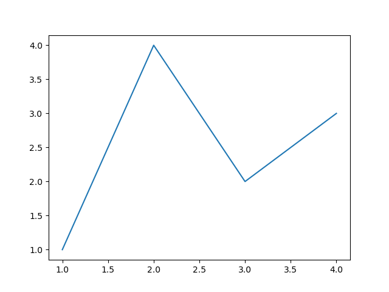
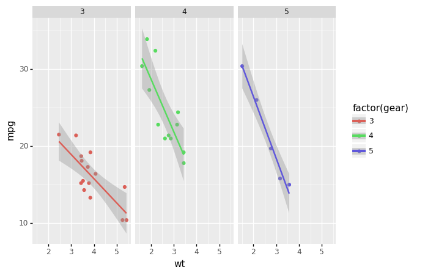
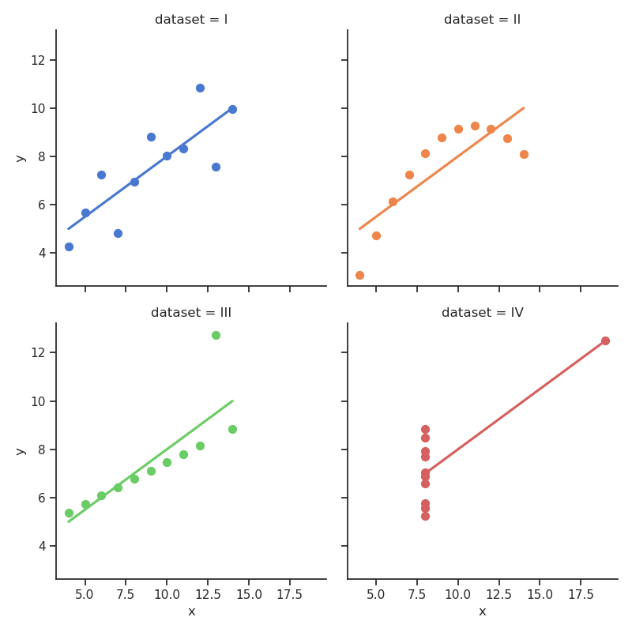

---
javascript:
- https://cdn.jsdelivr.net/npm/vega@5
- https://cdn.jsdelivr.net/npm/vega-lite@5
- https://cdn.jsdelivr.net/npm/vega-embed@6
---


# Images

## Supported formats

Mkreports supports inclusion out of the box of a number of different imaging 
libraries. For each supported library, an example is show below.

For any not supported library, it is still possible to write out the 
image manually and then include it as an `ImageFile` object.

### Matplotlib

For many scientific graphing purposes, `matplotlib` is either the direct
choice or the backend being used for plotting. 

=== "Content"

    

=== "Code"

    ```python title="/home/hhoeflin/projects/mkreports/tests/examples/usage/images.py" linenums="31"
    p.add(
        """
        For many scientific graphing purposes, `matplotlib` is either the direct
        choice or the backend being used for plotting. 
        """
    )

    fig, ax = plt.subplots()
    ax.plot([1, 2, 3, 4], [1, 4, 2, 3])

    ```

### Plotnine

Any plots created by `plotnine` can be included directly. The code below
is from the beginner example of the library.

=== "Content"

    

=== "Code"

    ```python title="/home/hhoeflin/projects/mkreports/tests/examples/usage/images.py" linenums="44"
    p.add(
        """
        Any plots created by `plotnine` can be included directly. The code below
        is from the beginner example of the library.
        """
    )

    pn_image = md.Image(
        ggplot(mtcars, aes("wt", "mpg", color="factor(gear)"))
        + geom_point()
        + stat_smooth(method="lm")
        + facet_wrap("~gear"),
    )

    ```

### Seaborn

Another well known option is Seaborn. The interface is similar to the 
ones before. Under the hood, the `figure` attribute of the seaborn plot is 
accessed and saved in the same fashion as for matplotlib.

=== "Content"

    

=== "Code"

    ```python title="/home/hhoeflin/projects/mkreports/tests/examples/usage/images.py" linenums="61"
    p.add(
        """
        Another well known option is Seaborn. The interface is similar to the 
        ones before. Under the hood, the `figure` attribute of the seaborn plot is 
        accessed and saved in the same fashion as for matplotlib.
        """
    )

    sns.set_theme(style="ticks")

    # Load the example dataset for Anscombe's quartet
    df = sns.load_dataset("anscombe")

    # Show the results of a linear regression within each dataset
    sea_img = md.Image(
        sns.lmplot(
            x="x",
            y="y",
            col="dataset",
            hue="dataset",
            data=df,
            col_wrap=2,
            ci=None,
            palette="muted",
            height=4,
            scatter_kws={"s": 50, "alpha": 1},
        ),
    )

    ```

### Altair

=== "Content"

    <div id='altair-a60f58418e1eda28fbf413975bb9247c'> </div>

=== "Code"

    ```python title="/home/hhoeflin/projects/mkreports/tests/examples/usage/images.py" linenums="93"
    import altair as alt
    import pandas as pd

    source = pd.DataFrame(
        {
            "a": ["A", "B", "C", "D", "E", "F", "G", "H", "I"],
            "b": [28, 55, 43, 91, 81, 53, 19, 87, 52],
        }
    )

    altair_chart = md.Altair(
        alt.Chart(source)
        .mark_bar()
        .encode(x="a", y="b")
        .properties(width=600)
    )

    ```

<script>
    vegaEmbed("#altair-a60f58418e1eda28fbf413975bb9247c", "../images_gen_assets/altair-a60f58418e1eda28fbf413975bb9247c.csv")
    // result.view provides access to the Vega View API
    .then(result => console.log(result))
    .catch(console.warn);
</script>

### Plotly

!!! warning

    Still to be implemented

## Different image sizes

!!! warning

    Still to be implemented
